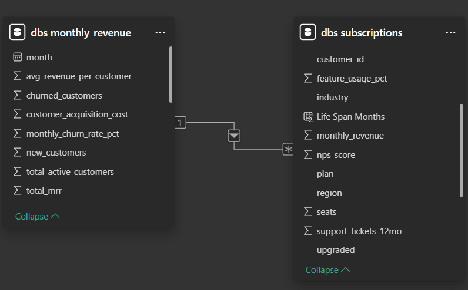

# Saas-Revenue-Churn-Analysis

## Project Background

Cloud Task Pro is a B2B Saas company that sells project management software. The company has access to subscription-level datasets with customer details, plan info, and churn status, as well as a monthly revenue summary. 

This project thoroughly analyses these datasets and synthesizes critical insights on Churn rate, Revenue Trends, Unit economics, and At-risk customers.

Insights and recommendations are provided on the following key areas:

- Churn analysis: Analysing `customer churn` and defining `high-risk segments`.
- Revenue Trends: Analysing historical trend patterns from 2022 January to 2025 December to uncover `revenue trends.`
- Unit Economics: Calculating `Customer Lifetime Value` and comparing it to `Customer acquisition cost` to determine the `CLV: CAC ratio`.
- At-Risk Customers: `Defining a threshold that flags at-risk customers and estimating how many customers fall into that bucket.`

### Data Pipeline and Architecture
- **Cloud Hosting:** Hosted relational subscription and financial data in **Micrsosft Azure.**
- **IDE & Database Querying:** Connected to Azure cloud environment via **Visual studio code (VS Code)**, utilizing **MSSQL (MIcrosoft SQL Server)** to perform data
  extraction, data exploration, multi-table joins, and baseline aggregations, etc.
- **Multi-variable Correlation Analysis:** Utilized **Python** to engineer a statistical correlation heatmap, discovering early behavioural churn indicators.
- **Business Intelligence:** Developed an interactive, 4-page diagnostic application in **Power BI Desktop** driven by custom DAX business
  logic and vertical asynchronous UI.

  The SQL queries can be found [here](MSSQL/Query.sql).
  
  The DAX measures can be found [here](DAX/measures.dax).
  
  The Python code can be found [here](Heatmap/heatmap.py).
  
  The visualizations can be found [here](images).

## Data Structure
CloudTask Pro's Datasets consist of 2 tables: subscriptions and monthly_revenue, having a total of 648 rows.
The tables were joined using the month column in the monthly_revenue table and the signed_up column in the subscriptions table with many-to-one cardinality.

## Executive Summary
### Overview of Findings
