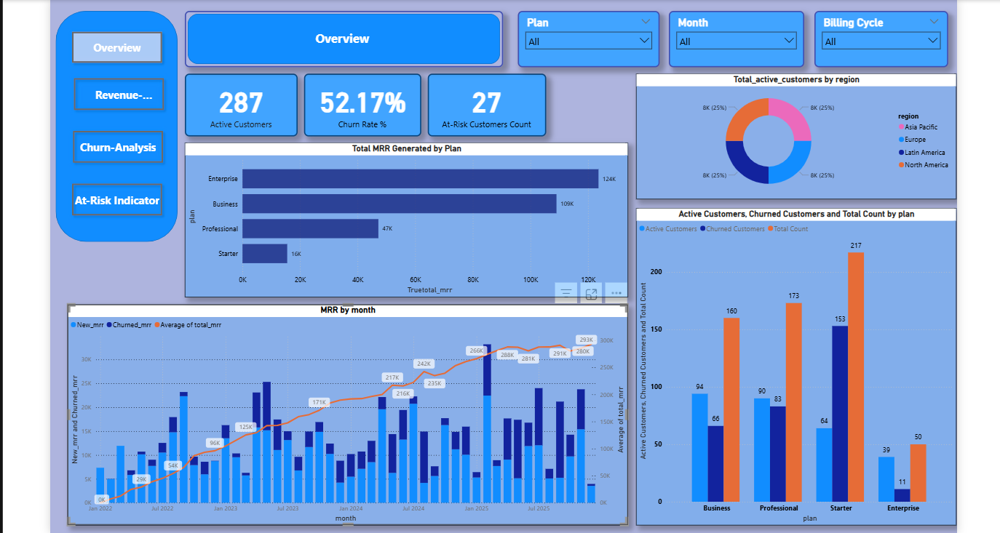
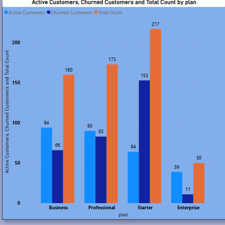
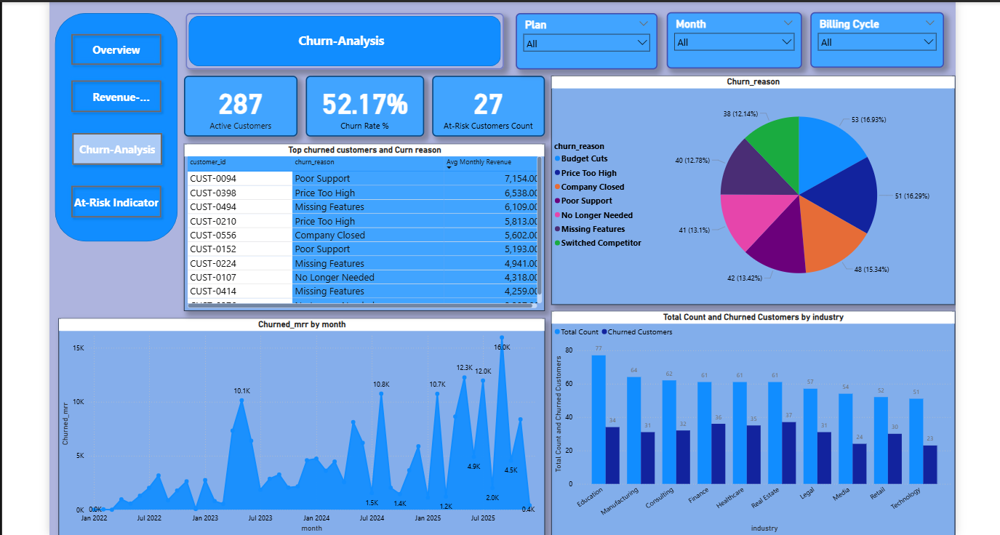
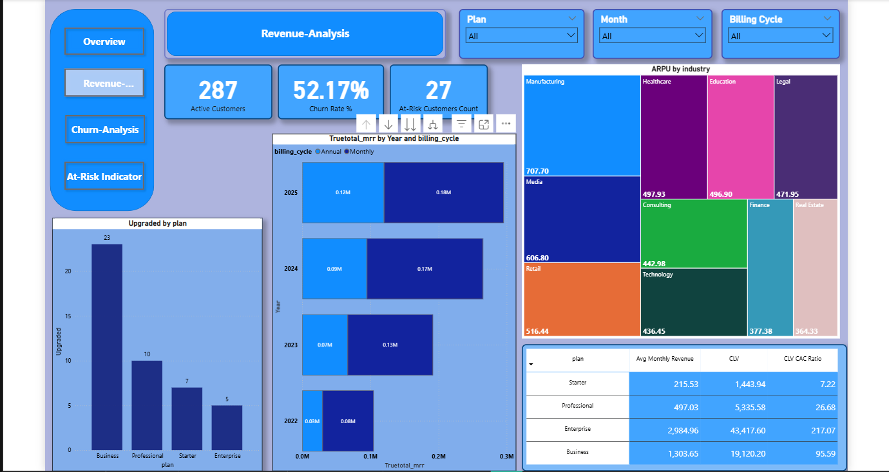
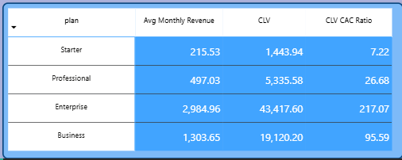
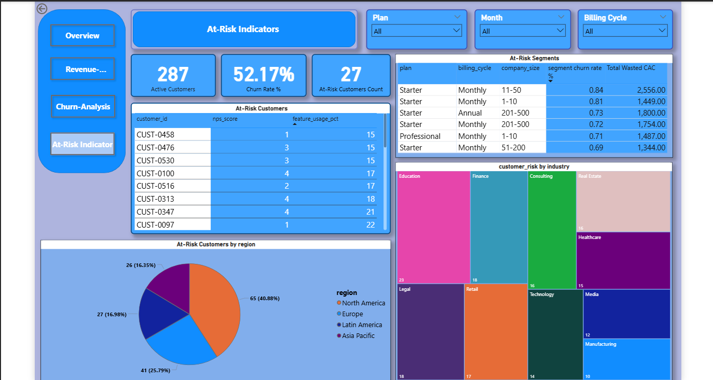
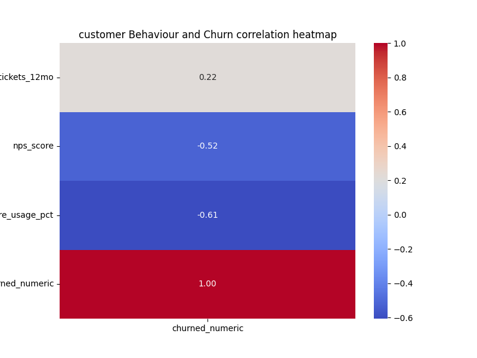

# Saas-Revenue-Churn-Analysis

## Project Background

Cloud Task Pro is a B2B Saas company that sells project management software. The company has access to subscription-level datasets with customer details, plan info, and churn status, as well as a monthly revenue summary. 

This project thoroughly analyses these datasets and synthesizes critical insights on Churn rate, Revenue Trends, Unit economics, and At-risk customers.

Insights and recommendations are provided on the following key areas:

- Churn analysis: Analysing `customer churn` and defining `high-risk segments`.
- Revenue Trends: Analysing historical trend patterns from 2022 January to 2025 December to uncover `revenue trends.`
- Unit Economics: Calculating `Customer Lifetime Value` and comparing it to `Customer acquisition cost` to determine the `CLV: CAC ratio`.
- At-Risk Customers: `Defining a threshold that flags at-risk customers and estimating how many customers fall into that bucket.`

### Data Pipeline and Architecture
- **Cloud Hosting:** Hosted relational subscription and financial data in **Micrsosft Azure.**
- **IDE & Database Querying:** Connected to Azure cloud environment via **Visual studio code (VS Code)**, utilizing **MSSQL (MIcrosoft SQL Server)** to perform data
  extraction, data exploration, multi-table joins, and baseline aggregations, etc.
- **Multi-variable Correlation Analysis:** Utilized **Python** to engineer a statistical correlation heatmap, discovering early behavioural churn indicators.
- **Business Intelligence:** Developed an interactive, 4-page diagnostic application in **Power BI Desktop** driven by custom DAX business
  logic and vertical asynchronous UI.

  The SQL queries can be found [here](MSSQL/Query.sql).
  
  The DAX measures can be found [here](DAX/measures.dax).
  
  The Python code can be found [here](Heatmap/heatmap.py).
  
  The visualizations can be found [here](images).

## Data Structure
CloudTask Pro's Datasets consist of 2 tables: subscriptions and monthly_revenue, having a total of 648 rows.
The tables were joined using the month column in the monthly_revenue table and the signed_up column in the subscriptions table with many-to-one cardinality.

## Executive Summary
### Overview of Findings
Despite a strong revenue growth of **83% CAGR** and a healthy CLV to CAC ratio of **39.7**, the company is facing a critical churn rate of **52.17%**.
While the Business and Professional plans show strong stability and upgrade activity, the **starter-monthly** segment represents a significant risk area with an **84% churn rate**.The following sections will dive deep into the important metrics.

### Churn Analysis
- Out of 600 Customers, 52.17% of customers churned, now a total of 287 customers are currently active.
- Segment that showed the highest churn rate(84%) is Starter-Monthly with less than 100 employees.
- 16 percent of companies churned gave the reason of `"Budget cuts"`,  and another 16 percent said `"Price too High"`.

   

### Revenue Analysis
- 83% CAGR was recorded during the years 2022-2025, in which 2025 saw the highest revenue.
- The Average monthly revenue is higher in the Enterprise plan, and the Business plan comes second.
- The Average Revenue Per User(ARPU) is 1029.3. The manufacturing industry has the highest ARPU of 1.3k.

  

### Unit Economics
- Companies are on average 9.73 months active as customers.
- The customer lifetime value(CLV) is 7951 dollars.
- The CLV: CAC Ratio is 39.7, which is a healthy ratio.
- Enterprise plan customers have a CLV of 43,417 dollars, and with a CLV of 19120 dollars, the Business plan comes second.

  .

### At-Risk Indicators
- Out of 287 active customers, 27 are at risk.
- Customers from North America has 40.88% churn rate.
- The industry with the highest churn rate is Education.
- The Companies who take the starter plan with a monthly payment and with less than 100 employees have 84% churn rate, also The Customer acquisition cost for this   segment is more than 2k.
- Customers with The behavioral churn indicators: nps_score < 4 and feature_usage_pct < 36 can be considered at Risk.

   

## Recommendations
- The company can create an automatic alert system for Customers who's nps_score comes down to 4 and feature_usage_pct becomes 36 or less, and give them extra care or attention to keep them as customers, especially those high-paying customers.
-  The company should keep an eye on the wasted customer acquisition cost. The segment that caused the most wasted CAC is starter - monthly - under 100 company size companies. Cut the budget to these segments and shift those dollars into high-retention, high Lifetime Value customers who are included in the Enterprise and business plan.
-  16 percent of customers churned, told reason for churn was "Price too high",13.42 percent said "poor support", and 12.78 percent said "missing features".The company can do something about 43 percent of these reasons customers churned. Give a thorough analysis on if change is needed or not.
-  Churned MRR has increased in 2025, were september 2025 saw 16k worth of mrr churned. If ARPU remains stagnant and churned MRR increases, it means the company is losing high-paying customers and replacing them with low-tier accounts. The company should increase the revenue from dedicated active accounts by making them pay by usage(utility-based pricing) or adding more features, and charging them to pay extra.

## Caveats and Assumptions
### Caveats
- Signup_date was a string and had to be changed to a date type.
- The monthly revenue table had a month column which was in format 'yyyy-MM' and signup_date in the subscriptions table was in 'yyyy-MM-DD,' so it had to be changed to the first of the month for the columns to have the same value to so that tables can be joined.
- Used the 75th percentile statistic on columns nps_score and feature_usage_pct to flag at-risk customers.
### Assumptions
- Numbers that represented price was assumed to be in dollars.
